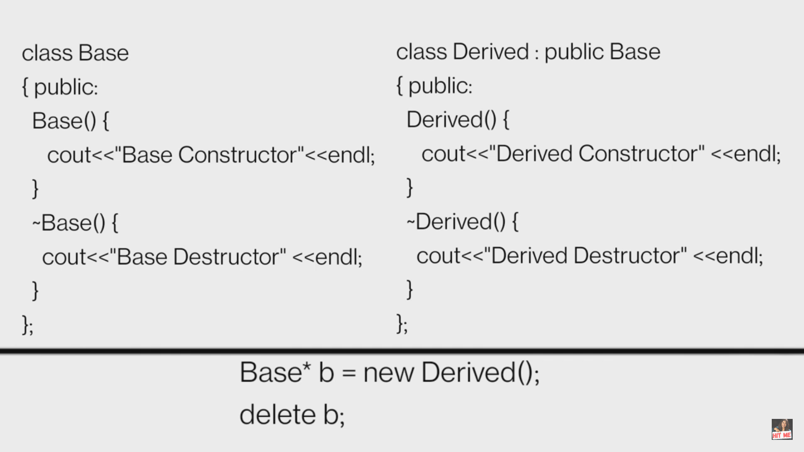

# OOPS

## CPP Interview

### Virtual Function

- A virtual function (also known as virtual methods) is a member function that is declared within a base class and is re-defined (overridden) by a derived class. When you refer to a derived class object using a pointer or a reference to the base class, you can call a virtual function for that object and execute the derived class’s version of the method.

- Virtual functions ensure that the correct function is called for an object, regardless of the type of reference (or pointer) used for the function call.
- They are mainly used to achieve Runtime polymorphism.
- Functions are declared with a virtual keyword in a base class.
- The resolving of a function call is done at runtime.

#### Rules for Virtual Functions

The rules for the virtual functions in C++ are as follows:

1. Virtual functions cannot be static.
2. A virtual function can be a friend function of another class.
3. Virtual functions should be accessed using a pointer or reference of base class type to achieve runtime polymorphism.
4. The prototype of virtual functions should be the same in the base as well as the derived class.
5. They are always defined in the base class and overridden in a derived class. It is not mandatory for the derived class to override (or re-define the virtual function), in that case, the base class version of the function is used.
6. A class may have a virtual destructor but it cannot have a virtual constructor.

#### Pure Virtual Functions

- Syntax: ```virtual void func() = 0;```
- Purpose: Declares a virtual function with no implementation in the base class.
- Requirement: Every derived class must provide its own implementation of the pure virtual function.
- Effect: Makes the base class **abstract**, meaning you cannot instantiate it directly.

### Working

#### UPCASTING

- Upcasting in C++ refers to the process of converting a pointer or reference of a derived class type to a pointer or reference of a base class type. It is a type of type casting that goes "up the hierarchy" (from a derived class to a base class).
- It is safe and automatic because the derived class is a specialized version of the base class, meaning it inherits all of the base class's attributes and behaviors (though it may add or override some).
- Whenever we have pointer of reference of **base class**, functions will be called **from base class** only irrespective of derived class object.

- **Requirement**: Call different logic (overridden) function for some derived class of base class.

- Solution: Use Runtime Polymorphism to implement this. [Virtual Functions]

### VTABLE (Virtual Table)

- **Compilation**: The compiler generates a **vtable** for classes with virtual functions. The vtable contains function pointers, with each class having its own vtable, even for derived classes.
- **Static Array**: The vtable is a static array shared by all instances of a class, ensuring all objects point to the same vtable.
- **Purpose**: It enables **runtime polymorphism** by dynamically dispatching function calls based on the actual object type, not the pointer/reference type.

### VPTR (Virtual Pointer)

- **What is VPTR**: Each object with virtual functions has a hidden pointer (**vptr**) pointing to the vtable of its class.
- **Inheritance**: Derived classes inherit the **vptr**, which is set to the appropriate vtable during object construction.
- **Late Binding**: The **vptr** facilitates late binding, ensuring virtual functions are dispatched based on the object's type at runtime.

### Runtime Polymorphism and Virtual Functions

- **Virtual Functions**: Functions that can be overridden in derived classes, resolved at runtime, enabling polymorphism.
- **Object-Based Resolution**: Calls to virtual functions are resolved using the **vptr** and the **vtable**, based on the object's actual type.
- **Static Functions**: Cannot be virtual because they are bound at compile time, whereas virtual functions depend on the object's actual type and are bound at runtime.

### Virtual Constructors and Destructors in C++

- **Why Destructors Should Be Virtual**:
  - In **runtime polymorphism**, if a destructor is **not virtual** in the base class, only the **base class destructor** is called when deleting an object through a base class pointer.
  - This leads to **undefined behavior** or **memory leaks** because the **derived class destructor** will not be invoked, leaving the derived class resources unfreed.

- **Why Constructors Can’t Be Virtual**:
  - **Constructors** cannot be virtual because they are responsible for **initializing** the object. During construction, the **vptr** (virtual pointer) is set, but it’s only initialized **after** the constructor runs.
  - Since **virtual functions** depend on the **vptr**, and polymorphism cannot happen until after the constructor finishes, the constructor cannot be virtual.

- **Note**: The **compiler does not** automatically make destructors virtual. If you want proper cleanup in derived classes, you must declare destructors as virtual yourself.


**- Go thru dynamic-cast and static_cast once.**
