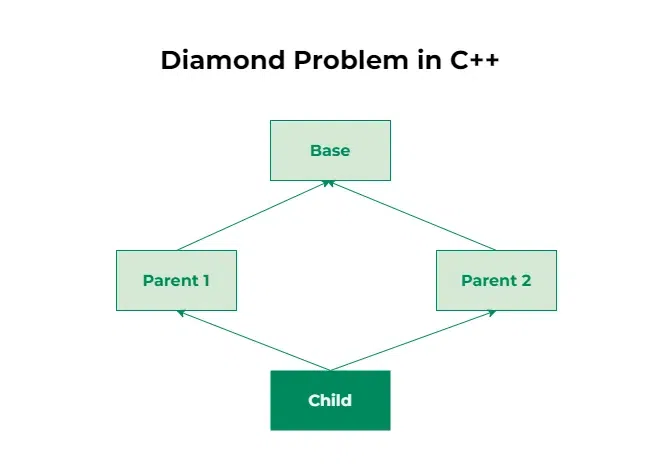

# OOPS

## Inheritance

### Single Inheritance

When one class inherits another class, it is known as single level inheritance.

#### Public Inheritance

- Public inheritance of Animal in Dog means that:
  - Public members of Animal remain public in Dog.
  - Protected members of Animal (if any) would remain protected in Dog.
  - Private members of Animal (if any) would still be inaccessible to Dog.

#### Protected Inheritance

- Protected inheritance of Animal in Cat means that:
  - Public members of Animal become protected in Cat.
  - Protected members of Animal (if any) would become protected in Cat.
  - Private members of Animal (if any) would still be inaccessible to Cat.

#### Private Inheritance

- Private inheritance of Animal in Cow means that:
  - Public members of Animal become private in Cow.
  - Protected members of Animal (if any) would become private in Cow.
  - Private members of Animal (if any) would still be inaccessible to Cow.

### MultiLevel

- Process of deriving a class from another derived class.

### Multiple

- It is process of deriving a new class hat inherits attribute from two or more classes.

### Hierarchical

- Defined as deriving more than one class from base class.

### Hybrid

- Combination of single, multiple and hierarchical inheritance.

## Problems

### Diamond Problem

- Multiple inheritance is one such type of inheritance that allows a class to inherit from more than one base class
- The Diamond Problem is an ambiguity error that arises in multiple inheritance when a derived class inherits from two or more base classes that share a common ancestor. This results in the inheritance hierarchy forming a diamond shape, hence the name "Diamond Problem." The ambiguity arises because the derived class has multiple paths to access members or methods inherited from the common ancestor, leading to confusion during method resolution and member access.
  
- Ways to Fix:
  - Scope Resolution Operator:
    - Syntax: ```ObjectName.ClassName::functionName();```
    - It helps resolve ambiguity as we explicitly identify path for accessing the function.
  
  - Virtual Inheritance

### NOTE

- Private members of the base class are not accessible in the derived class or from outside.
- Protected members are accessible within derived classes but not outside.
- Public members are accessible both within derived classes and by objects of derived classes.
- Private inheritance makes all inherited members private in the derived class, so they can only be accessed within that derived class and not by objects.
- Protected inheritance makes inherited members protected in the derived class, so they are accessible to subclasses but not to objects.
- Public inheritance allows the base class's public members to be accessed directly through derived class objects.
- Protected inheritance restricts access to the base class's members to within the derived class or its subclasses.
- Private inheritance makes the base class's public and protected members accessible only within the derived class itself and not outside.
